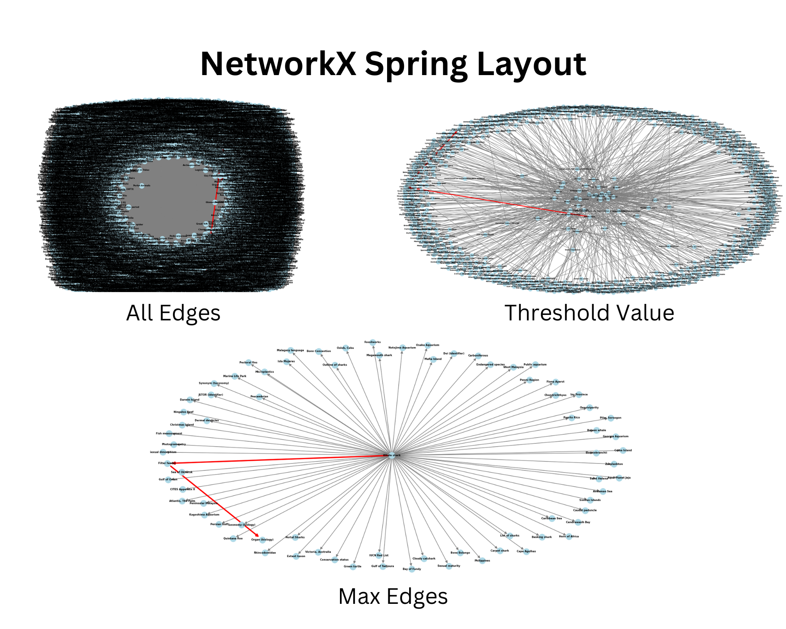
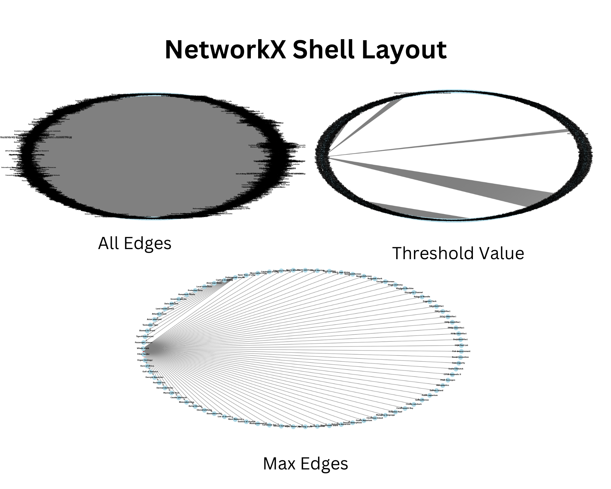
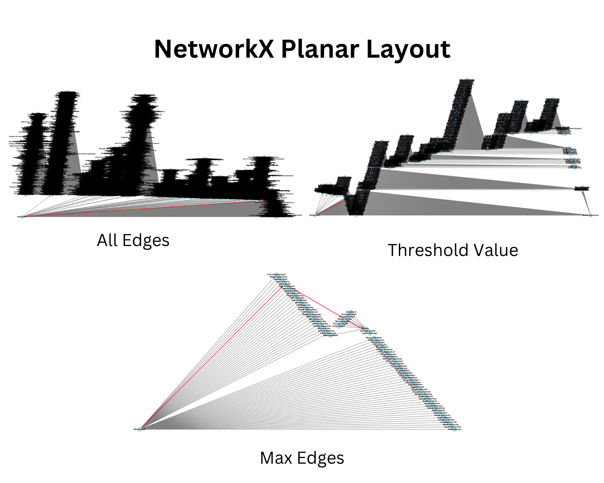
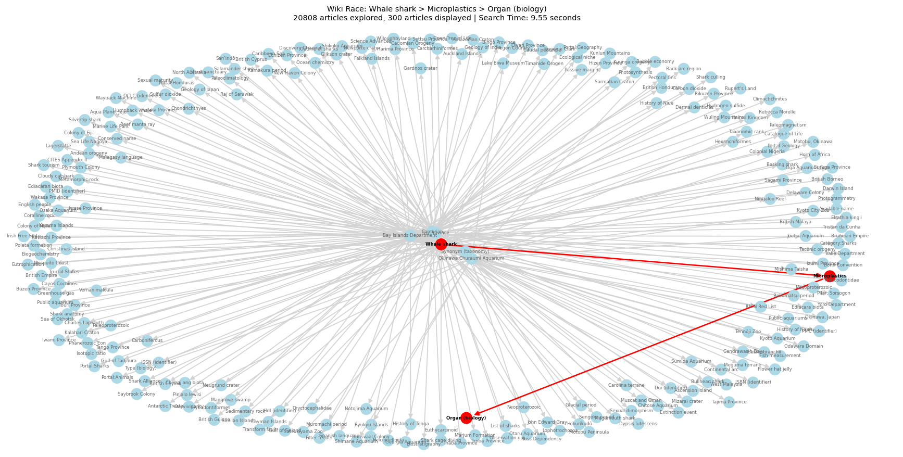

# Wiki Race

This program finds a path from one Wikipedia article to another using only hyperlinks.
Still a work in progress.

---

## Speed and Efficiency

### Threading
The program initially only used threading in `wikiRace.py` with 20 max workers. To try and increase speed even further, threading was added to `aStar.py` with 10 max workers. In some rare cases, this cut down the program runtime by over 10 seconds. However, in most cases, it increased the runtime by over 10 seconds. 

Typically, the threading in `aStar.py` would increase runtime on shorter, less complex paths due to the overhead. For the more complex paths, it would decrease program runtime by a few seconds. I ended up making the threading in `aStar.py` optional with the default being to not use it.

### BFS
Originally, the program used Breadth-First Search to try to find the shortest possible path between the start and end articles. This solution ended up taking a very long time for the program to finish, even with threading. It took **over 180 seconds** to make a search that was two hyperlinks away (Whale Shark > Filter Feeder > Organ (biology)) and **over 200 seconds** for another search that was two hyperlinks away (Whale Shark > Japan > Formula One).

### A* Search
#### Placeholder Heuristic (Title Length)
After testing with BFS, I switched over to A* Search. `aStar.py` was originally written using Wikipedia article title lengths to estimate the cost between two nodes. This was meant to be a placeholder until a better method was determined. Using this heuristic, the search that took BFS over 180 seconds (Whale Shark > Filter Feeder > Organ (biology)) only took A* **10 seconds.** The search that took BFS over 200 seconds (Whale Shark > Japan > Formula One) took A* **55 seconds.** After further optimization (caching links data so that pages are only fetched once), the (Whale Shark > Filter Feeder > Organ (biology)) search took as little as **2 seconds.** Since the program is threaded, this does not happen every time since the search path is never the same as the previous run, which means the search can still take up to around **45 seconds**. Compared to the BFS time of 180+ seconds, 45 seconds is still a huge improvement.

#### Wikipedia2vex Heuristic
After determining A* would be a better overall search algorithm to use for this program, I tried to find a better method of estimating cost for the heuristic function. The first idea tested was using , which is a model of word2vec (which obtains vector representations of words) that was specifically trained on Wikipedia articles. However, even with threading, this method was too complex and increased the speed exponentially since it was vectorizing each Wikipedia article title. The search that took A* using title lengths 2 seconds (Whale Shark > Filter Feeder > Organ (biology)) took A* using Wikipedia2vec **488 seconds.**

#### Wikipedia Categories Heuristic
Since Wiki2vec took too long due to complexity, Wikipedia categories was tried as a heuristic. Each link would be fetched, parsed, and be assigned a set of categories. The function would check for category overlap. Similarly to the Wiki2vec, this increased the search time because of the added complexity of fetching every page and parsing it to get its categories. Based on the previous two heuristic attempts, the heuristic will need to be based off of some value that has no increased complexity like webscraping or vectorizing.

#### Title Overlap Heuristic
By comparing title string overlap, no unneccesary complexity is added. The search that took the title lengths heuristic 2 seconds (Whale Shark > Filter Feeder > Organ (biology)) took title overlap between **2 and 9 seconds**. The biggest difference between this heuristic function and the title lengths is that title overlap *consistently* takes between **3-7 seconds**. Out of around 20 tests, the longest it took to search Whale Shark > Filter Feeder > Organ (biology) was **30 seconds**, which was an outlier. The second longest search was only 9.2 seconds. Compared to title lengths, which took anywhere from 2 to 45 seconds (and was not consistently low), using title overlap to calculate heuristics improved search time immensely.

## Visualizing Graph
After completing the search, the graph is visualized using  and . Because the search is so complex due to the threading, displaying all nodes makes the graph *very* unreadable. I tried out three different functions to see which was the easiest to read and made the most sense visually. I also added constraints, like setting a maximum number of nodes or a threshold for nodes based on heuristics.

While adding a maximum number of nodes removes the aspect of just how complex the graph is, it is the most readable. The final visualized graph ended up being a spring layout graph with a maximum of 300 nodes and a threshold of 5 (this can change depending on the heuristic).

## Current Status
Currently, `wikiRace.py` is using A* Search with title lengths as estimate cost comparison. `wikiRace.py` is threaded with 20 max workers, and `aStar.py` is threaded with 10 max workers, but defaults to using no threading.

## Future Goals
Continue optimizing the search heuristic and visualized graph.